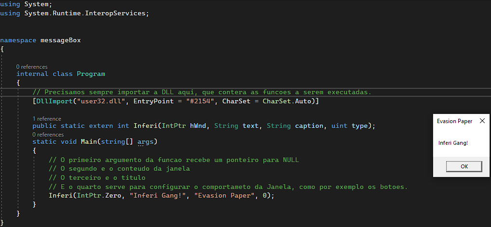

É muito comum na área de red team, ao fazer um teste de intrusão em uma rede interna, nos depararmos com soluções de defesa como anti-virus, as quais cada dia evoluem mais e mais, um ramo onde milhões de dólares são investidos na aprimoração das suas técnicas de detecção. Sabendo disso, atacantes buscam sempre por novas táticas para evadir essas soluções, sejam elas mais simples como anti-virus ou mais complexas como EDRs e XDRs no geral.

Hoje, como uma breve introdução ao tema de defense evasion, vou apresentar a vocês uma técnica muito legal, a qual pode ser usada para obfuscar a chamada direta de funções em seu código. Essa é uma técnica possui um funcionamento interessante e fácil, além disso, carece de documentações acerca, logo dificultando a vida dos mecanismos de defesa.

# Sobre Ordinals, vamos lá!!!

Primeiramente, a seguir temos um código comum escrito em C#. O código basicamente exibe um popup com uma mensagem, utilizando a função MessageBox da dll `user32.dll` do Windows. Dentro dessa DLL, temos a definição da função que utilizaremos assim como seu código compilado, no caso referente a função MessageBox.

```csharp
using System;
using System.Runtime.InteropServices;

namespace messageBox
{

    internal class Program
    {
        // Precisamos sempre importar a DLL aqui, que contera as funcoes a serem executadas.
        [DllImport("user32.dll", SetLastError = true, CharSet = CharSet.Auto)]

        public static extern int MessageBox(IntPtr hWnd, String text, String caption, uint type);
        static void Main(string[] args)
        {
            // O primeiro argumento da funcao recebe um ponteiro para NULL
            // O segundo e o conteudo da janela
            // O terceiro e o titulo
            // E o quarto serve para configurar o comportameto da Janela, como por exemplo os botoes.
            MessageBox(IntPtr.Zero, "Hello from Pinvoke!", "Titulo Janela", 0);
        }
    }
}
```

O código acima deve funcionar normalmente como mencionado, você pode executá-lo em sua máquina sem nenhum problema. Entretanto, em termos de evasão esse código é bastante problemático e, nesse paper aprenderemos a contornar o maior deles.

## O Problema e a Solução

Qual o maior problema? Simples! As definições das funções que serão chamadas está em texto plano, ou seja, se um anti-virus utilizasse regras para bloquear a chamada de função `MessageBox` simplesmente verificando por uma string, nosso código não funcionaria.

Para contornar isso, ou melhor, evadir essa regra hipotética, podemos fazer um melhor uso do atributo `DllImport` em C#. Existem várias formas de se usar `DllImport` e uma delas é com o uso de *ordinals*:

- Um ordinal é um index que identifica uma função em uma dll
- Podemos utilizar um ordinal para fazer chamadas de API sem necessariamente usar o nome da função

Ao utilizar ordinals, podemos mudar a assinatura de um PE.

# Ordinals na Prática

Para que se tenha uma melhor ideia do que são ordinals, vamos fazer uma análise de uma dll buscando-os manualmente. Primeiramente, vamos utilizar um utilitário chamado `PEView`, que nos permite olhar a fundo a estrutura de um PE / DLL.

Ao abrir o programa, vamos importar diretamente da pasta System32, a dll que estamos utilizando em nosso código, que é a `user32.dll`.

Após importar a dll, clique nas seguintes opções:
1. SECTION .text
2. EXPORT ADDRESS TABLE

E descendo um pouco encontramos a função "MessageBoxW" `086A`, assim como o valor que acompanha essa função. Encontramos os valores tanto para as funções ANSI (que terminam com A) quanto as UNICODE (W) e extendidas (Ex). 


Vamos precisar desse valor no nosso código, mas antes precisamos converter o mesmo para decimal!

<p class="message">
ATENÇÃO! Esses valores numéricos podem dependendo da versão do Windows
</p>

Bom, o `DllImport` possui um argumento chamado `EntryPoint`, o qual indica o ponto de entrada para executar a função no código. Conseguimos utilizar o `EntryPoint` com um número (ordinal) ou o próprio nome da função.

Abaixo um exemplo:
```csharp
using System;
using System.Runtime.InteropServices;

namespace messageBox
{

    internal class Program
    {
        // Precisamos sempre importar a DLL aqui, que contera as funcoes a serem executadas.
        [DllImport("user32.dll", EntryPoint = "#2154", CharSet = CharSet.Auto)]

        public static extern int Inferi(IntPtr hWnd, String text, String caption, uint type);
        static void Main(string[] args)
        {
            // O primeiro argumento da funcao recebe um ponteiro para NULL
            // O segundo e o conteudo da janela
            // O terceiro e o titulo
            // E o quarto serve para configurar o comportameto da Janela, como por exemplo os botoes.
            Inferi(IntPtr.Zero, "Inferi Gang!", "Evasion Paper", 0);
        }
    }
}
```

No código acima, perceba, definimos no parâmetro `EntryPoint` o ordinal da função `MessageBoxW` que vimos com o PEView, porém o valor foi convertido de hexadecimal (`086A`) para decimal (`2154`).

Como o `EntryPoint` da função já está previamente definido para `2154`, o nome da função se torna irrelevante, nos dando a possibilidade de utilizarmos qualquer nome no lugar do nome original. Dessa forma, quando nosso código for análisado por EDR's ou qualquer solução de defesa que faça verificações de chamadas, bypassemos tal, pois ele não vai encontrar o nome da função :)

Exemplo:


# Conclusão

Nesse paper, vimos não só como ofuscar uma chamada de sistema, mas a importância de conhecermos a fundo as features da linguagem, principalmente quando se trata de evasão e malwares.


